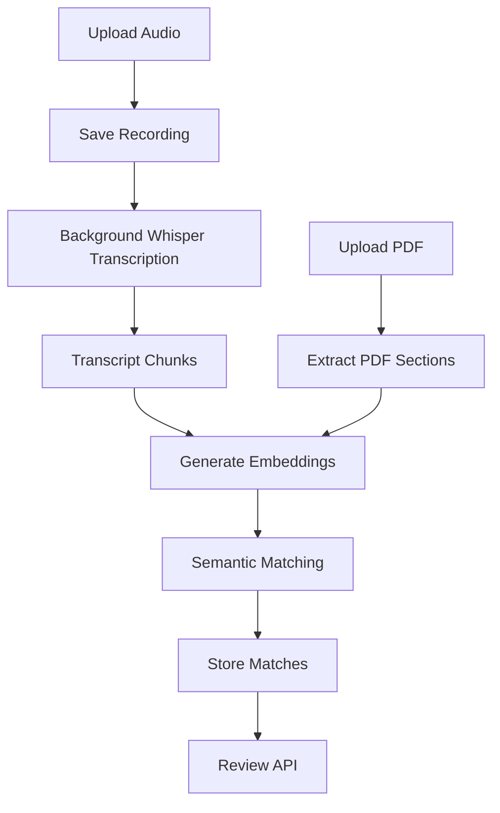
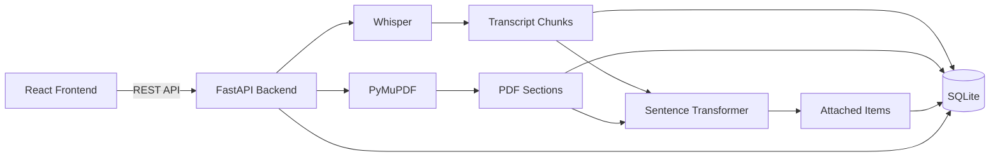
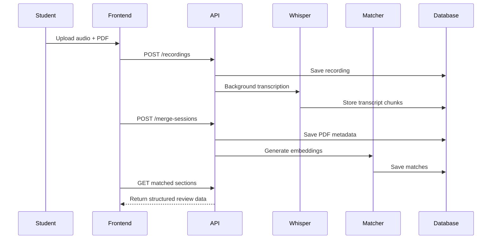
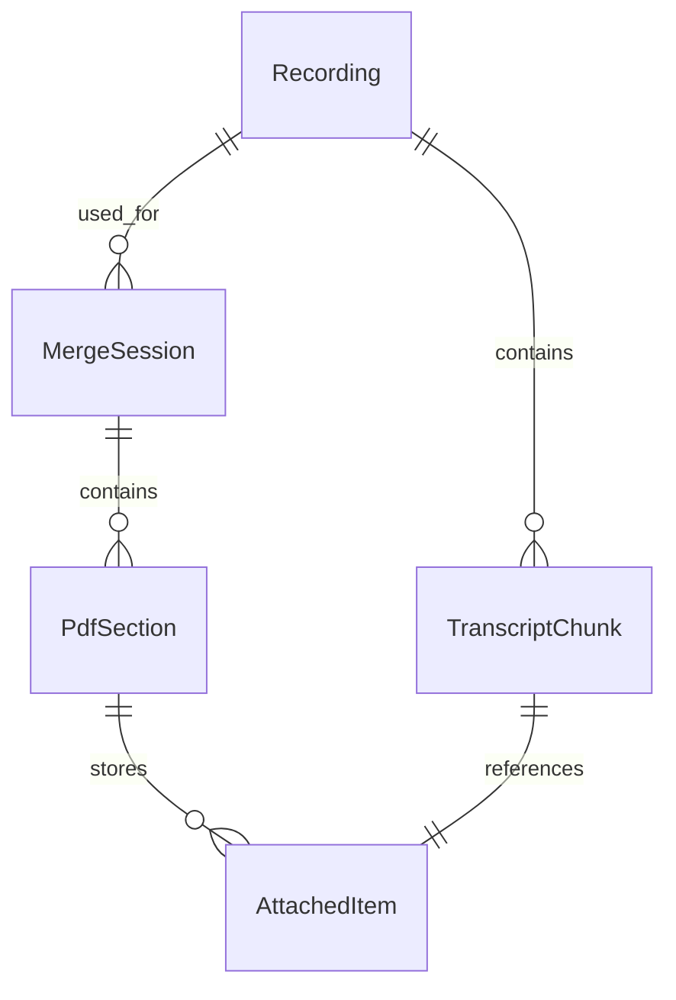

# LectureMerge API


Backend service for **LectureMerge**, an AI-powered application that automatically merges a lecturer's spoken explanations into the relevant sections of lecture slides.

Instead of forcing students to switch between lecture recordings and PDFs, LectureMerge creates a structured review workflow that aligns transcript segments with the appropriate slide content using semantic similarity.

---

# Table of Contents

- Features
- Motivation
- Tech Stack
- System Workflow
- Architecture
- Upload & Matching Flow
- Project Structure
- Database Design
- API Endpoints
- Engineering Decisions
- Setup
- API Documentation
- Current Limitations
- Future Improvements
- License

---

# Features

- Upload lecture recordings
- Background audio transcription using Whisper
- Upload lecture PDFs
- Automatic PDF section extraction
- Semantic matching between transcript chunks and slide sections
- Confidence scoring for every match
- Review API for editing and confirming matches
- Structured storage of transcript-to-slide relationships
- Foundation for merged lecture note generation

---

# Motivation

During lectures, instructors often provide explanations, examples, and clarifications that never appear in the lecture slides.

Students therefore have two disconnected learning resources:

- Lecture slides
- Audio recordings

LectureMerge bridges these sources by automatically placing spoken explanations beneath the most relevant slide section, producing a richer set of lecture notes.

---

# Tech Stack

| Technology | Purpose |
|------------|---------|
| FastAPI | REST API |
| SQLAlchemy | ORM |
| SQLite | Database |
| OpenAI Whisper | Speech-to-text transcription |
| PyMuPDF | PDF parsing |
| Sentence Transformers | Semantic embeddings |
| scikit-learn | Cosine similarity |
| Uvicorn | ASGI Server |

---

# System Workflow



---

# Architecture



---

# Upload & Matching Flow



---

# Project Structure

```text
lecturemerger-api/

├── routers/
│   ├── recordings.py
│   └── merge_sessions.py
│
├── services/
│   ├── transcription.py
│   ├── pdf_parser.py
│   └── matcher.py
│
├── models.py
├── schemas.py
├── database.py
├── dependencies.py
└── main.py
```

---

# Database Design



The application uses five primary entities.

### Recording

Stores uploaded lecture recordings.

### TranscriptChunk

Stores timestamped transcript segments generated by Whisper.

### MergeSession

Represents a merge between one recording and one uploaded PDF.

### PdfSection

Stores extracted lecture slide sections.

### AttachedItem

Stores transcript chunks attached to PDF sections after semantic matching.

---

# API Endpoints

## Recordings

| Method | Endpoint | Description |
|---------|----------|-------------|
| POST | `/recordings/` | Upload audio recording |
| GET | `/recordings/` | List recordings |
| GET | `/recordings/{id}` | Get recording |
| GET | `/recordings/{id}/chunks` | Retrieve transcript chunks |

---

## Merge Sessions

| Method | Endpoint | Description |
|---------|----------|-------------|
| POST | `/merge-sessions/` | Upload lecture PDF |
| POST | `/merge-sessions/{id}/match` | Run semantic matching |
| GET | `/merge-sessions/{id}/sections` | Retrieve parsed PDF sections |

---

# Engineering Decisions

## Background Processing

Whisper transcription is executed as a FastAPI background task.

Returning the upload response immediately keeps the API responsive while long-running transcription continues asynchronously.

---

## Semantic Matching

Keyword matching performs poorly because lecturers frequently explain concepts without repeating the exact wording found on slides.

Instead, LectureMerge generates sentence embeddings for transcript chunks and PDF sections using Sentence Transformers.

Cosine similarity is then used to determine the most semantically relevant destination section.

---

## Modular Service Layer

Business logic is separated into dedicated service modules:

- `transcription.py`
- `pdf_parser.py`
- `matcher.py`

This keeps API routers focused on request handling while making the application easier to test and extend.

---

## Database Design

Recordings and merge sessions are intentionally decoupled.

A single lecture recording can therefore be merged against multiple versions of lecture slides without requiring retranscription.

---

# Setup

Clone the repository.

```bash
git clone https://github.com/LolaVictoria/lecturemerger-api.git

cd lecturemerger-api
```

Create a virtual environment.

```bash
python -m venv venv
```

Activate it.

### Windows

```bash
venv\Scripts\activate
```

### macOS/Linux

```bash
source venv/bin/activate
```

Install dependencies.

```bash
pip install -r requirements.txt
```

Run the server.

```bash
uvicorn main:app --reload
```

---

# API Documentation

After starting the server:

Swagger UI

```
http://127.0.0.1:8000/docs
```

ReDoc

```
http://127.0.0.1:8000/redoc
```

---

# Current Limitations

The project currently loads both Whisper and Sentence Transformer models directly inside the FastAPI process.

Because these models consume significant memory, deployment exceeds the **512 MB memory limit** available on many free hosting platforms.

A production deployment would typically:

- move inference into dedicated worker processes
- replace SQLite with PostgreSQL
- store uploaded files in cloud object storage
- process transcription through a distributed task queue

---

# Future Improvements

## Infrastructure

- Docker
- PostgreSQL
- Redis
- Celery background workers
- Cloud object storage

## Machine Learning

- Improved PDF section extraction
- Better confidence calibration
- Alternative embedding models

## Product

- Authentication
- Collaborative note editing
- Automatic merged PDF generation
- Search across merged notes
- Export to Markdown and Word

---

# License

This project is licensed under the MIT License.
