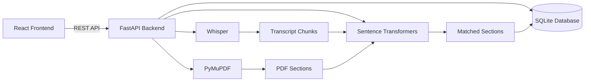

# LectureMerge API

Backend service for **LectureMerge**, an AI-powered application that automatically merges a lecturer's spoken explanations into the relevant sections of lecture slides.

Instead of forcing students to switch between lecture recordings and PDFs, LectureMerge creates a structured review workflow that aligns transcript segments with the appropriate slide content using semantic similarity.

---

## Features

- Upload lecture recordings
- Background audio transcription using Whisper
- Upload lecture PDFs
- Automatic PDF section extraction
- Semantic matching between transcript chunks and slide sections
- Confidence scoring for every match
- Review API for editing and confirming matches
- Generate structured data for merged lecture notes

---

## Demo Workflow

```
Upload Audio
      │
      ▼
Save Recording
      │
      ▼
Whisper Transcription
      │
      ▼
Transcript Chunks
      │
      ▼
Upload Lecture PDF
      │
      ▼
Extract PDF Sections
      │
      ▼
Semantic Matching
      │
      ▼
Review & Confirm
      │
      ▼
Merged Lecture Notes
```

---

## Motivation

During lectures, instructors often provide explanations, examples and clarifications that never appear in the lecture slides.

Students therefore have two disconnected sources of information:

- PDF slides
- Audio recordings

LectureMerge bridges these sources by automatically placing spoken explanations under the correct PDF section, producing notes that combine both.

---

## Tech Stack

| Technology | Purpose |
|------------|---------|
| FastAPI | REST API |
| SQLAlchemy | ORM |
| SQLite | Database |
| OpenAI Whisper | Speech-to-text transcription |
| PyMuPDF | PDF parsing |
| SentenceTransformers | Semantic embeddings |
| scikit-learn | Cosine similarity |
| Uvicorn | ASGI server |

---

## Architecture


---

# Project Structure

```text
lecturemerger-api/

├── routers/
│   ├── recordings.py
│   └── merge_sessions.py
│
├── services/
│   ├── transcription.py
│   ├── pdf_parser.py
│   └── matcher.py
│
├── models.py
├── schemas.py
├── database.py
├── dependencies.py
└── main.py
```

---

# Database Design

The application uses five core tables.

```
Recording
    │
    ├──────────────┐
    ▼              ▼
TranscriptChunk   MergeSession
                       │
                       ▼
                  PdfSection
                       │
                       ▼
                  AttachedItem
```

### recordings

Stores uploaded lecture recordings.

### transcript_chunks

Stores timestamped transcript segments generated by Whisper.

### merge_sessions

Represents a merge between one recording and one uploaded PDF.

### pdf_sections

Stores extracted lecture slide sections.

### attached_items

Stores transcript chunks attached to PDF sections during semantic matching.

---

# API Endpoints

## Recordings

| Method | Endpoint | Description |
|---------|----------|-------------|
| POST | `/recordings/` | Upload audio recording |
| GET | `/recordings/` | List recordings |
| GET | `/recordings/{id}` | Get recording |
| GET | `/recordings/{id}/chunks` | Transcript chunks |

---

## Merge Sessions

| Method | Endpoint | Description |
|---------|----------|-------------|
| POST | `/merge-sessions/` | Upload PDF |
| POST | `/merge-sessions/{id}/match` | Run semantic matching |
| GET | `/merge-sessions/{id}/sections` | PDF sections |

---

# Engineering Decisions

## Background Transcription

Transcription runs as a FastAPI background task.

This allows uploads to return immediately instead of forcing users to wait for long-running transcription jobs.

---

## Semantic Matching

Keyword matching performs poorly because lecturers often explain concepts without repeating the exact slide wording.

Instead, LectureMerge generates sentence embeddings for:

- transcript chunks
- PDF sections

Cosine similarity is then used to determine the most relevant destination section.

---

## SQLAlchemy ORM

SQLAlchemy separates persistence logic from API endpoints and allows future migration from SQLite to PostgreSQL with minimal changes.

---

# Setup

Clone the repository.

```bash
git clone https://github.com/LolaVictoria/lecturemerger-api.git

cd lecturemerger-api
```

Create a virtual environment.

```bash
python -m venv venv
```

Activate it.

Windows

```bash
venv\Scripts\activate
```

Mac/Linux

```bash
source venv/bin/activate
```

Install dependencies.

```bash
pip install -r requirements.txt
```

Run the server.

```bash
uvicorn main:app --reload
```

Swagger documentation is available at

```
http://127.0.0.1:8000/docs
```

---

# Current Limitations

The application currently loads both Whisper and SentenceTransformer directly inside the FastAPI process.

These models exceed the **512 MB memory limit** of Render's free tier.

For production deployment this workload would be moved to:

- dedicated background workers
- GPU inference services
- object storage for uploaded files

while keeping the API lightweight.

---

# Future Improvements

- PostgreSQL
- Docker
- Redis
- Celery background workers
- Authentication
- Object storage
- GPU inference
- Better confidence calibration
- Automatic merged PDF generation

---

# License

MIT License.
